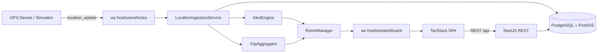

# Vehicle Tracking System

[](https://serkanbayraktar.com/)
[](https://github.com/Serkanbyx)
[](https://www.typescriptlang.org/)
[](https://nestjs.com/)
[](https://react.dev/)
[](https://www.postgresql.org/)

> **Demo recording:** Replace this block with a GIF or short screen recording of the dashboard (use seeded or simulator vehicles only—no production data).

```text
<!-- Demo GIF placeholder: docs/demo.gif -->
```

Fleet visibility with live GPS updates, MapLibre maps, geofences, alerts, trips, exports, and role-based access— backed by NestJS, PostgreSQL + PostGIS, and a TanStack Router SPA.

## Architecture



_Note:_ With the Vite dev server, the browser uses `/ws` and `/api` on port **3000**; those paths are proxied to the API server (default **5000**). In production, point `VITE_WS_URL` / `VITE_API_URL` at your deployed API host.

## Features

- Live vehicle positions on MapLibre with smoothing and status (moving / idle / offline)
- WebSocket updates for the dashboard; ingest path for devices/simulator
- Geofences (polygon & circle), containment tests, and enter/exit alerting
- Speed and idle alerts with acknowledgement workflows
- Trip history, summaries, and CSV exports (vehicle routes + trips)
- Admin area: users, roles, fleet overview
- JWT access tokens + HTTP-only refresh cookies, RBAC guards
- Uploads (driver / vehicle / avatar) via Cloudinary
- Observability hooks: Sentry (when configured), structured logging with redaction

## Tech stack

| Layer | Technologies |
| ----- | ------------ |
| API | NestJS 11, TypeORM, PostgreSQL + PostGIS, `ws`, Passport JWT |
| SPA | React 19, TanStack Router & Query & Form, Vite, Tailwind CSS v4, MapLibre GL |
| Quality | Vitest, Playwright (E2E), Biome |

## Roles & permissions

| Role | Capabilities |
| ---- | ------------ |
| **viewer** | Read vehicles, locations/history/stats/heatmap, geofences, trips, alerts; route export (`GET /api/vehicles/:id/export`). Cannot create/update/delete vehicles or geofences, cannot acknowledge alerts. |
| **manager** | Viewer capabilities plus create/update/delete vehicles & geofences, acknowledge alerts (`POST /alerts/:id/ack`, `ack-many`), driver & vehicle image uploads, delete uploaded assets by `publicId`. |
| **admin** | Manager capabilities plus admin APIs (`/admin/*`), bulk vehicle activate (`POST /vehicles/bulk-activate`), delete alerts (`DELETE /alerts/:id`), full user lifecycle management. |

_Unauthenticated routes:_ `POST /api/auth/register`, `POST /api/auth/login`, `POST /api/auth/refresh`, `GET /api/health`, and HTTP location ingest with simulator key (see Locations).

## REST API overview

### Auth

| Method | Path | Auth | Description |
| ------ | ---- | ---- | ----------- |
| POST | `/api/auth/register` | Public | Register |
| POST | `/api/auth/login` | Public | Login (sets refresh cookie) |
| POST | `/api/auth/refresh` | Refresh cookie | Rotate tokens |
| GET | `/api/auth/me` | JWT | Current user |
| PATCH | `/api/auth/me` | JWT | Update profile |
| POST | `/api/auth/change-password` | JWT | Change password (clears refresh cookie) |
| POST | `/api/auth/logout` | JWT | Logout |
| DELETE | `/api/auth/me` | JWT | Delete account |

### Vehicles

| Method | Path | Roles | Description |
| ------ | ---- | ----- | ----------- |
| POST | `/api/vehicles` | manager, admin | Create vehicle |
| GET | `/api/vehicles` | JWT | List/query vehicles |
| GET | `/api/vehicles/nearby` | JWT | Nearby vehicles |
| GET | `/api/vehicles/:id` | JWT | Vehicle detail |
| PATCH | `/api/vehicles/:id` | manager, admin | Update vehicle |
| DELETE | `/api/vehicles/:id` | manager, admin | Delete vehicle |
| GET | `/api/vehicles/:id/heatmap` | JWT | Heatmap points (time range) |
| GET | `/api/vehicles/:id/export` | JWT | Export route CSV or GeoJSON (`format` query) |
| POST | `/api/vehicles/bulk-activate` | admin | Bulk activate |

### Locations (`/api/vehicles/:vehicleId/...`)

| Method | Path | Auth | Description |
| ------ | ---- | ---- | ----------- |
| GET | `/api/vehicles/:vehicleId/history` | JWT | Location history |
| GET | `/api/vehicles/:vehicleId/locations/latest` | JWT | Latest N points |
| GET | `/api/vehicles/:vehicleId/stats` | JWT | Aggregated stats |
| POST | `/api/vehicles/:vehicleId/locations` | `X-Simulator-Key` | HTTP ingest fallback |

### Geofences

| Method | Path | Roles | Description |
| ------ | ---- | ----- | ----------- |
| POST | `/api/geofences` | manager, admin | Create |
| GET | `/api/geofences` | JWT | List |
| GET | `/api/geofences/:id` | JWT | Detail |
| PATCH | `/api/geofences/:id` | manager, admin | Update |
| DELETE | `/api/geofences/:id` | manager, admin | Delete |
| POST | `/api/geofences/:id/test` | JWT | Test point inside/outside |

### Alerts

| Method | Path | Roles | Description |
| ------ | ---- | ----- | ----------- |
| GET | `/api/alerts` | JWT | List/filter |
| GET | `/api/alerts/stats` | JWT | Stats |
| POST | `/api/alerts/:id/ack` | manager, admin | Acknowledge |
| POST | `/api/alerts/ack-many` | manager, admin | Bulk acknowledge |
| DELETE | `/api/alerts/:id` | admin | Delete |

### Trips

| Method | Path | Auth | Description |
| ------ | ---- | ---- | ----------- |
| GET | `/api/trips` | JWT | List/filter |
| GET | `/api/trips/summary` | JWT | Daily summary |
| GET | `/api/trips/export` | JWT | CSV export |
| GET | `/api/trips/:id` | JWT | Trip detail |

### Uploads

| Method | Path | Roles | Description |
| ------ | ---- | ----- | ----------- |
| POST | `/api/uploads/driver` | manager, admin | Upload driver image (`multipart field: image`) |
| POST | `/api/uploads/vehicle` | manager, admin | Upload vehicle image |
| POST | `/api/uploads/avatar` | JWT | Upload avatar |
| DELETE | `/api/uploads/:publicId` | manager, admin | Delete Cloudinary asset |

### Admin

| Method | Path | Roles | Description |
| ------ | ---- | ----- | ----------- |
| GET | `/api/admin/stats` | admin | Dashboard stats |
| GET | `/api/admin/users` | admin | User list |
| GET | `/api/admin/users/:id` | admin | User detail |
| PATCH | `/api/admin/users/:id/role` | admin | Set role |
| PATCH | `/api/admin/users/:id/status` | admin | Activate/deactivate |
| DELETE | `/api/admin/users/:id` | admin | Remove user |
| GET | `/api/admin/fleet` | admin | Fleet overview |

### Health

| Method | Path | Auth | Description |
| ------ | ---- | ---- | ----------- |
| GET | `/api/health` | Public | Liveness / uptime |

## WebSocket protocol

Base URL is the same origin as the HTTP API host (e.g. `ws://localhost:5000`). Messages are JSON text frames.

### `/ws/vehicles` (ingest / simulator)

**Authentication**

- Header **`X-Simulator-Key`**: must match server `SIMULATOR_API_KEY` (timing-safe compare).
- Optional **`X-Device-Id`**: logical device id (defaults to `unknown`).
- If **`Origin`** is sent, it must match **`CLIENT_URL`**.

**Inbound**

| Event / shape | Payload |
| ------------- | ------- |
| `location_update` | `vehicleId` (UUID v4), `lng`, `lat`, `speed`, optional `heading`, `altitude`, `accuracy`, `timestamp` (ISO 8601) |

The bundled GPS simulator sends frames shaped as `{ "event": "location_update", "data": { ...fields } }`, which Nest routes to the `location_update` handler.

**Outbound**

| Shape | Meaning |
| ----- | ------- |
| `{ "event": "error", "data": { "message": string } }` | Validation or server-side error |

Rate limit: **5** `location_update` handlers per socket per second.

### `/ws/dashboard` (SPA live feed)

**Authentication**

- Subprotocol **`Sec-WebSocket-Protocol`**: JWT **access** token (same secret as REST).
- If **`Origin`** is sent, it must match **`CLIENT_URL`**.

On connect, the socket joins room `role:<userRole>` (`viewer`, `manager`, or `admin`).

**Inbound**

| Type | Body | Effect |
| ---- | ---- | ------ |
| `subscribe` | `{ "vehicleId": "<uuid>" }` | Join room `vehicle:<vehicleId>` |
| `unsubscribe` | `{ "vehicleId": "<uuid>" }` | Leave that vehicle room |

Invalid `vehicleId` responds with `{ "event": "error", "data": { "message": "Invalid vehicleId" } }`.

**Outbound**

Clients should parse each frame as JSON with a top-level discriminator **`type`** (flat payload); internal handlers often split `{ type, ...rest }`.

| type | Payload fields | Notes |
| ---- | -------------- | ----- |
| `vehicle:update` | `vehicleId`, `plate`, `coordinates` `[lng, lat]`, `speed`, `heading`, `timestamp`, `status` | Emitted after ingest to vehicle room + all role rooms |
| `vehicle:status` | `vehicleId`, `status` (`offline`) | Emitted when sweep marks stale trackers offline |
| `alert:new` | `alert` — server **Alert** entity snapshot (`id`, `vehicleId`, `type`, `severity`, `message`, `geom`, `speed`, `geofenceId`, acknowledgement fields, …) | Includes speed/geofence alerts; **there is no separate `geofence:event` message**—geofence enter/exit use `alert.type` `geofence_enter` / `geofence_exit` inside `alert:new` |

## Folder structure

```text
.
├── client/                 # Vite + React SPA
│   ├── src/
│   │   ├── routes/       # TanStack file routes
│   │   ├── components/
│   │   ├── api/
│   │   └── ...
│   └── e2e/              # Playwright specs
├── server/                 # NestJS API
│   ├── src/
│   │   ├── modules/      # Feature modules (auth, vehicles, …)
│   │   ├── migrations/
│   │   └── scripts/      # seed-admin, seed-test, gps-simulator
│   └── test/e2e/         # Vitest + Supertest API tests
├── docs/build-guide.md   # Build curriculum / checklist
└── README.md
```

## Getting started

### Prerequisites

- **Node.js** 20+
- **PostgreSQL** 16+ with **PostGIS** (local Docker or managed e.g. Supabase)
- **Cloudinary** account (required for production uploads; optional for local exploration if you stub or skip uploads)

### Backend

```bash
cd server
npm install
cp .env.example .env   # fill DATABASE_URL, JWT secrets, SIMULATOR_API_KEY, etc.
npm run mig:run
npm run seed:admin     # optional: initial admin from ADMIN_* env vars
npm run dev            # http://localhost:5000 — API prefix /api
```

Recommended log levels: **development** → `LOG_LEVEL=debug`; **test** → `silent`; **production** → `info`.

### Frontend

```bash
cd client
npm install
cp .env.example .env   # VITE_API_URL, VITE_WS_URL, optional Sentry
npm run dev            # http://localhost:3000 — proxies /api and /ws to backend
```

### Typical dev terminals

1. `cd server && npm run dev`
2. `cd client && npm run dev`
3. `cd server && npm run simulate` — pushes synthetic locations (ensure vehicles exist—create via UI as Manager or use seed data)

## GPS simulator

Runs `server/src/scripts/gps-simulator.ts`:

| Env / flag | Purpose |
| ---------- | ------- |
| `SIMULATOR_API_KEY` | Must match server; sent as `X-Simulator-Key` |
| `SOCKET_URL` | WebSocket base (default `ws://localhost:5000`) |
| `API_URL` | REST base for optional setup calls (default `http://localhost:5000/api`) |
| `--vehicles=N` | Fleet size (default `5`) |
| `--tick=ms` | Interval between ticks (default `2000`) |
| `--speedSpikeChance=0.08` | Probability of overspeed sample |
| `--bbox=minLng,minLat,maxLng,maxLat` | Bounding box (default Istanbul-ish demo bounds) |

## Security notes

- Never commit `.env` files or real JWT/simulator keys.
- Logs redact `Authorization`, cookies, passwords, and refresh tokens where Pino redaction is configured.
- Use HTTPS and secure cookie flags in production; keep `CLIENT_URL` aligned with the SPA origin.
- Prefer strong secrets (`SIMULATOR_API_KEY`, JWT secrets ≥ 32 chars in production).
- Record demos only against disposable databases and test accounts.

## Future: TimescaleDB for location history

For high-volume telemetry, consider migrating the locations table to Timescale hypertables:

```sql
-- Illustrative — adapt to your actual locations table name/columns
SELECT create_hypertable('"location"', 'timestamp', if_not_exists => TRUE);
```

Tune chunk intervals and retention policies to match your SLA and storage budget.

## Deployment

See **[docs/build-guide.md](docs/build-guide.md) — STEP 86** for production deployment guidance (hosting, env, migrations, and CDN/static assets).

## Developer

**Serkanby**

- Website: [serkanbayraktar.com](https://serkanbayraktar.com/)
- GitHub: [@Serkanbyx](https://github.com/Serkanbyx)
- Email: [serkanbyx1@gmail.com](mailto:serkanbyx1@gmail.com)

## Contact

- [Open an Issue](https://github.com/Serkanbyx/s5.2_Vehicle-Tracking-System/issues)
- Email: [serkanbyx1@gmail.com](mailto:serkanbyx1@gmail.com)
- Website: [serkanbayraktar.com](https://serkanbayraktar.com/)

## License

[PolyForm Noncommercial 1.0.0](LICENSE) © 2026 Serkan Bayraktar
